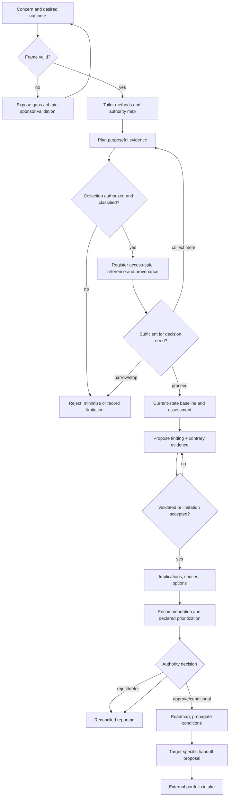
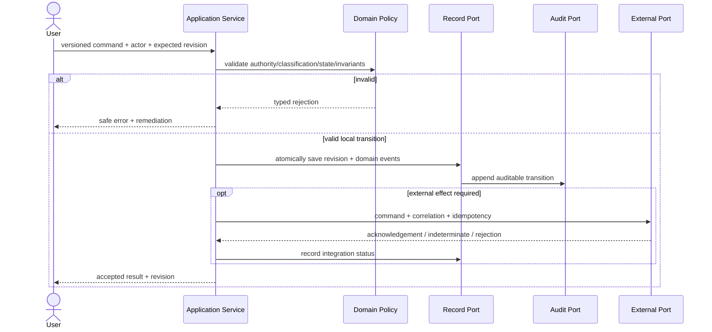
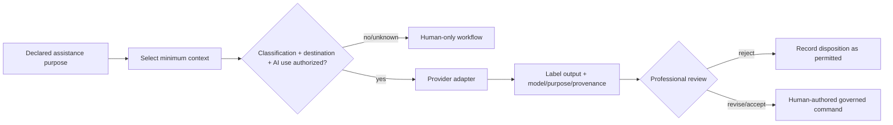
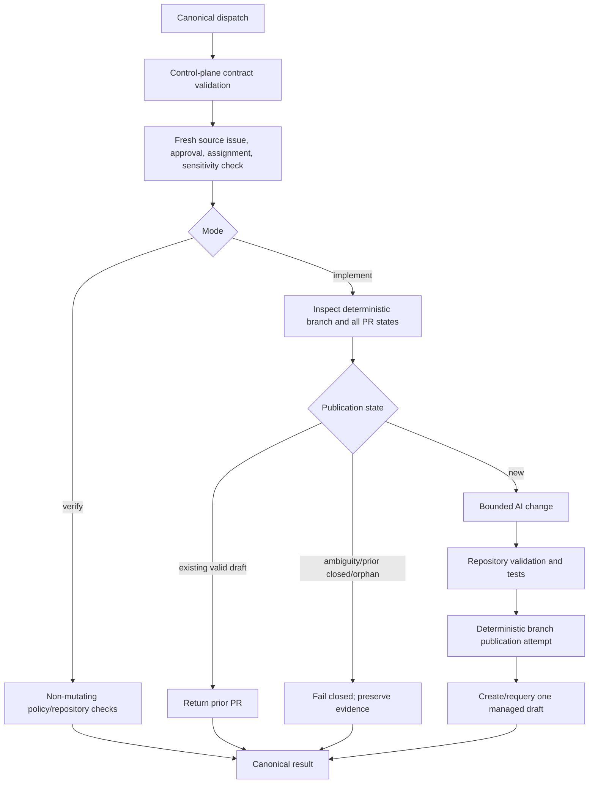

# Data Flow Design

## Data classes and boundaries

| Flow object | Source | Transformation | Destination | Authority |
|---|---|---|---|---|
| Concern/context | Sponsor/practitioner | Frame, scope and decision purpose | Engagement context | Sponsor validates |
| Evidence request | Engagement plan | Minimize and classify | Evidence custodian | Custodian controls source |
| Evidence reference | Client/source/participant | Register provenance, kind, limitation and access | Evidence register | Source remains external |
| Analysis | Practitioner + evidence | Sufficiency, baseline, finding, implication, options | Reasoning graph | Consultant accountable; reviewers validate |
| Recommendation | Reasoning graph | Prioritization and feasibility | Decision authority | Advice only |
| Decision | Named authority | Validate scope, record rationale/conditions | Decision register | Authority owns disposition |
| Action proposal | Approved decision | Decompose/minimize/version | Portfolio intake | External owner accepts/rejects |
| Report | Canonical reasoning graph | Access filtering and audience projection | Stakeholders | No new facts/state |
| Lesson proposal | Follow-up | Generalize, confidentiality/content review | Knowledge catalog | Maintainer publishes |
| Execution dispatch/result | Control plane | Repository policy/validation/publication | Draft PR + control plane result | External contract; local effect |

## Primary consulting flow

## Command, event and query flow

Events are past-tense facts such as `FindingValidated`, `DecisionRecorded`, `HandoffAcknowledged` and `KnowledgeAssetPublished`. Event consumers may rebuild views or trigger authorized orchestration; they must not infer approval from event presence.

## Recommendation-to-portfolio flow

Inputs include traceable approved/conditional decision, conditions, business outcome, scope/exclusions, acceptance outcomes, target owner, dependencies, risks, classification, source links, correlation and idempotency identity. The local system validates completeness and destination authorization, submits to the external intake contract, records acknowledgement, and reconciles external state. It never assigns authoritative external IDs or silently retries business rejection.

## AI assistance flow

AI cannot write authoritative state directly. Provider prompts/responses are not logged by default and sensitive input cannot cross a boundary without specific authorization.

## Target execution flow

## Transformation rules

- Normalization must not erase original values, uncertainty or provenance.
- Derived scores retain formula/policy version and inputs; they are advisory.
- Redaction creates a derivative with a link and classification, not a replacement of authoritative source.
- Report projections include source revision and “as of” time.
- External adapter translation validates both inbound and outbound structures.
- Correlation identifiers are safe metadata; prompts, secrets and confidential content are excluded from operational telemetry.

## Failure and recovery flow

Validation rejection returns to the responsible actor. Concurrency conflict reloads current revision before a deliberate retry. External timeout becomes `indeterminate`; reconciliation precedes resubmission. An unavailable evidence source becomes a limitation. A failed projection can be rebuilt. Audit write failure blocks governed mutation. Publication ambiguity requires operator review and a newly authorized logical identity when replacement is intended.
