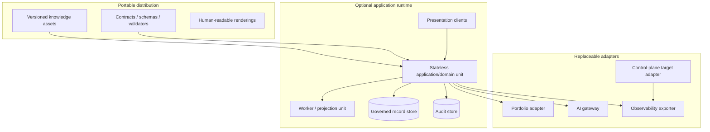

# Deployment Architecture

## Deployment principles

Deployment is deliberately conceptual. The product must function as a versioned portable knowledge distribution. Optional automation or a hosted runtime may be introduced without changing domain semantics or requiring a specific cloud, database, broker or framework.

## Logical deployment units

The current target execution workflow is a separate ephemeral CI deployment unit. It must not be coupled to any future consulting application availability or data store.

## Environments and promotion

Knowledge, schemas and application units progress through review/validation, non-production acceptance and approved release. Environments isolate identities, credentials, stores and external endpoints. Production/client information is prohibited in development/test unless specifically authorized and protected. Immutable artifact identity and compatibility evidence accompany promotion; rollback selects a known-good version rather than editing history.

## Scaling

- Static distribution scales through ordinary artifact/content delivery and offline copies.
- Stateless application/query/rendering units scale horizontally.
- Long-running assessment export, projection and integration work uses bounded workers if needed.
- Partition governed instance data by client/engagement/region only after policy and demand validation.
- Immutable knowledge assets cache safely by version; authority and classification decisions use bounded freshness.
- Rate limits/backpressure protect external systems and AI cost/exposure.

Scale targets cannot be invented until engagement volume, artifact size, concurrency and latency requirements are validated. Architecture tests must nevertheless prevent algorithms that require scanning all engagements for a single operation.

## Availability and resilience

Manual/offline consulting remains available when optional runtime or integrations fail. A runtime should use redundant stateless units, durable transactional records, health-based routing and isolated connectors according to approved SLOs. Audit/state durability is more important than transient projection availability. External outages produce resumable/indeterminate status and reconciliation, not corrupted authority.

## Persistence, backup and recovery

No database technology is prescribed. If instance records are stored, the selected store must support revisions, atomic governed mutation with audit, access isolation, encryption, retention/legal hold and tested restore. Backup location/retention follows the same classification as source. Restore validation checks integrity, authorization and external-effect replay suppression. Recovery objectives remain unknown until business impact is agreed.

## Network and trust topology

Default deny inbound and outbound; expose only presentation/API endpoints needed for a selected deployment. Integration adapters use separate egress and credentials. Administrative and audit access are isolated. AI and client-system connectivity are optional, purpose-bound routes. The target executor receives only the minimum workflow permissions and publishes a draft through protected hosting APIs.

## Release and rollback

Release units declare knowledge/schema/application versions and supported contract matrix. Use progressive rollout for behavioral automation, synthetic/de-identified smoke scenarios and compatibility gates. Rollback must preserve newer records/readability and never re-run an external effect. For executor rollback, disable dispatch first, restore the known-good workflow/policy/contract pin, and reconcile identities already published before redelivery.

## Deployment acceptance questions

Before selecting infrastructure, resolve: instance storage and tenancy; jurisdictions/residency; retention/deletion; availability/recovery objectives; expected concurrency/size; identity federation; approved AI providers; accessibility/export; operational ownership and cost envelope.
