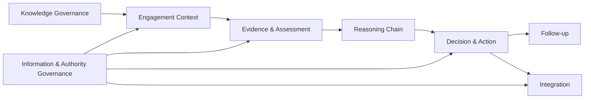
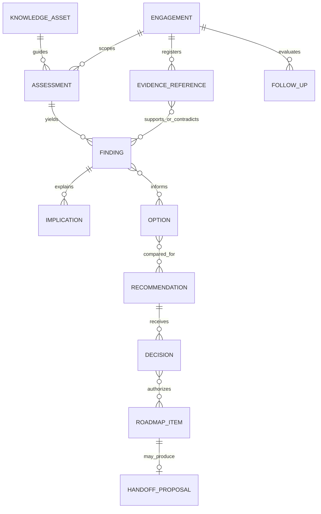

# Domain Model

## Ubiquitous language

An **engagement** is bounded consulting work. **Evidence** is source material or an access-safe reference; a **participant assertion**, **observation**, **inference** and **hypothesis** are distinct epistemic kinds. A **finding** is a supported conclusion about the scoped current state; an **implication** explains why it matters. A **recommendation** is advice, while a **decision** is an authority's disposition. A **handoff proposal** is not a portfolio task until accepted by its external owner.

## Bounded contexts

## Aggregates and entities

| Aggregate root | Owned entities/value objects | Boundary and lifecycle |
|---|---|---|
| Engagement | Frame revisions, Scope, Outcome, Constraint, SuccessMeasure, TailoringDecision, StakeholderRole reference | Owns consulting context, not external evidence/portfolio state. Proposed, active, paused, closed, cancelled. |
| Evidence Plan | EvidenceQuestion, EvidenceRequest, SufficiencyCriterion | Owns purposeful/proportionate collection plan. Draft, authorized, active, complete/superseded. |
| Evidence Register | EvidenceReference, Provenance, EvidenceKind, Locator, PermittedUse, Limitation | Owns reference metadata, not necessarily content. Requested, available, validated, disputed, inaccessible, retired. |
| Current-State Model | BaselineElement, ObservationLink, Omission, TimeWindow | Immutable reviewed baseline revisions. |
| Assessment | DomainSelection, CapabilityJudgment, Anchor, Risk, Gap | Context-specific result using a pinned method version. |
| Finding | EvidenceLink, ContraryEvidenceLink, Implication, Confidence, AcceptedLimitation | Proposed, validated, disputed, superseded, withdrawn. |
| Option Analysis | Option, Benefit, Cost/EffortRange, Risk, Dependency, Tradeoff | Compares alternatives including no-action where meaningful. |
| Recommendation | PriorityAssessment, RecommendationRevision, Condition reference | Proposed; disposition is linked Decision, not embedded consultant authority. |
| Decision | AuthoritySnapshot, Disposition, Rationale, Condition, DecisionHistory | Approved, rejected, deferred, conditional, superseded; immutable decisions superseded by new records. |
| Roadmap | RoadmapItem, Sequence, Milestone, Owner, Dependency, DecisionPoint | Includes approved/conditional recommendations only. |
| Handoff | TaskProposal, TargetOwnership, IdempotencyIdentity, Acknowledgement | Prepared, validated, submitted, acknowledged, rejected, indeterminate, cancelled. |
| Follow-up Assessment | OutcomeObservation, BaselineComparison, AttributionLimit, LessonProposal | Planned, in progress, evaluated, closed. |
| Knowledge Asset | AssetVersion, Applicability, Owner, Compatibility, Review | Draft, in review, published, deprecated, withdrawn. |
| Delivery | DeliveryIdentity, ExecutionContext, PublicationReference, Result | Received, authorized, executing, published/reused, failed/blocked. |

## Core value objects

Stable identifiers, semantic versions, revisions, classification, confidence, time window, effort range, priority criterion, authority scope, provenance, permitted purpose, destination, condition, correlation identity and idempotency identity are immutable values. `Unknown`, blank, disputed and not-applicable are different values, never aliases.

## Relationships

This is conceptual cardinality, not a database schema.

## Business invariants

1. Every engagement has a sponsor/internal owner and explicit decision purpose; unresolved required fields remain visible.
2. A material final finding has sufficient traceable evidence or an explicit limitation accepted by appropriate authority.
3. Contrary evidence, disagreement, uncertainty and scope limits remain linked throughout revisions.
4. A causal assertion identifies rationale and considered alternatives; correlation alone is insufficient.
5. Capability ratings identify context, observable anchors, evidence and uncertainty and imply no universal target.
6. Every governed state change records actor, time, rationale and prior state.
7. Only an authenticated actor with applicable scope can create a decision; participation does not imply authority.
8. Only approved or conditional recommendations enter a roadmap/handoff, and conditions remain attached.
9. Priority criteria are declared; overrides record authority and rationale.
10. Audience projections cannot disagree on material fact, state, priority, uncertainty or decision.
11. Unknown classification is restricted. Transfer approval is bound to purpose, destination, minimum content and time.
12. Client-specific content becomes a Knowledge Asset only through authorization, minimization/generalization, confidentiality review and content approval.
13. AI output is labeled assistance and cannot become evidence of a client fact or an authoritative decision without professional evaluation.
14. One logical delivery identity permits at most one completed managed publication effect; ambiguous ownership blocks.

## Ownership and lifecycle distinction

Definitions and reusable knowledge are repository-owned. Engagement records are controlled by the engagement and client governance even if a repository tool manipulates them. External evidence remains custodian-owned. Decisions are authority-owned. Portfolio Tasks owns accepted backlog records and states. These ownerships cannot be changed by copying data.
