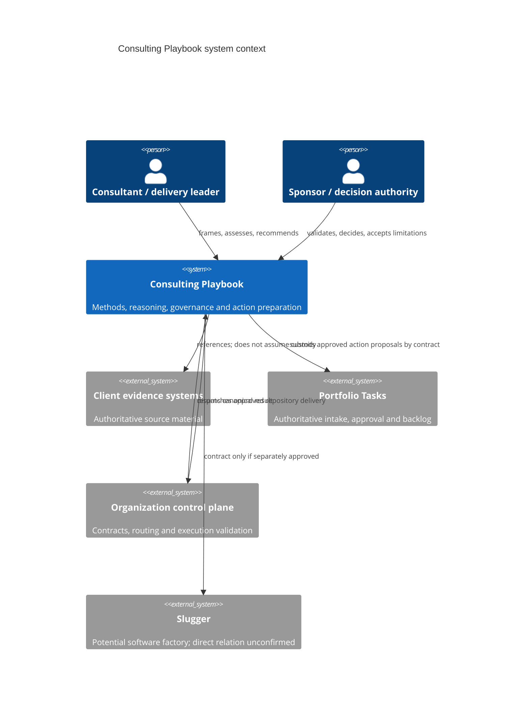

# High-Level Design

## Purpose and context

The Consulting Playbook is a portable body of governed knowledge and a logical system for producing traceable consulting outcomes. A user may execute it manually using human-readable artifacts or through a future application. Both modes obey the same domain policies and interfaces.

## Decomposition and layers

| Layer | Subsystems | Rule |
|---|---|---|
| Presentation | Human-readable artifacts, optional UI/CLI, executive and technical views | Renders and captures intent; never decides policy. |
| Application | Engagement, assessment, recommendation, reporting, handoff and execution use cases | Orchestrates transactions and ports. |
| Domain | Entities, invariants, state transitions, classification and authority policy | Pure business semantics; inward dependencies only. |
| Knowledge | Method definitions, templates, assessment domains, patterns | Versioned inputs to use cases, never client facts. |
| Ports | Repositories, clocks, identity, portfolio/control plane, AI, publication, telemetry | Technology-neutral contracts. |
| Infrastructure | Files, databases, Git, GitHub, renderers, provider APIs | Replaceable adapters; externally owned semantics translated at boundary. |

## Major subsystems

### Knowledge management

Catalogs and releases reusable assets with applicability, owners, review state, version, dependencies, limitations and deprecation data. It prevents client-specific material entering reusable content without authorization and generalization.

### Engagement workspace

Creates a bounded engagement context. It owns frame revisions, tailoring, authority map and links to externally held evidence. It does not imply that records must be stored in this Git repository.

### Inquiry and assessment

Plans proportionate evidence, registers provenance and handling, evaluates sufficiency, creates dated current-state models and applies composable domain assessments.

### Analysis and recommendation

Maintains the typed reasoning graph. Findings require evidence or accepted limitations; causes remain hypotheses until supported; recommendations expose alternatives, impacts, effort ranges, dependencies, uncertainty and consequence of inaction.

### Decision, roadmap and follow-up

Records decisions by valid authorities, permits only approved/conditional recommendations into action plans, creates independently governable handoffs, and compares outcomes against a dated baseline.

### Presentation and reconciliation

Projects one canonical reasoning chain into audience-appropriate views. A reconciliation check prevents differences in material fact, state, priority, uncertainty or decision.

### Delivery automation

Consumes a control-plane-owned execution contract, revalidates source authority at the trust boundary and provides verify or bounded implement behavior. Publication uses deterministic logical identity and stops on ambiguity.

## Information flow

```mermaid
flowchart LR
  Concern --> Frame --> Plan
  Plan --> Request[Evidence requests]
  Sources[External evidence sources] --> Reference[Evidence references]
  Request --> Reference --> Sufficiency
  Sufficiency --> Baseline --> Finding
  Finding --> Implication --> Options --> Recommendation
  Recommendation --> Decision
  Decision -->|approved/conditional| Roadmap --> Handoff
  Handoff --> Portfolio[External portfolio intake]
  Decision --> Reports
  Finding --> Reports
  Portfolio --> FollowUp[Outcome observations]
  FollowUp --> Lessons[Governed generalized lessons]
  Lessons --> Catalog[Knowledge catalog]
```

Iteration may revisit earlier stages, but skipped normative stages require recorded rationale. Each material link carries stable identity and version/provenance.

## Ownership boundaries

| Information | Owner | Local treatment |
|---|---|---|
| Reusable methods/templates | This repository | Canonical, versioned and reviewed. |
| Engagement reasoning records | Designated engagement owner; location TBD | Logical ownership modeled; storage does not transfer authority. |
| Raw client evidence | Client/custodian system | Access-safe reference only by default. |
| Consulting decision record | Named decision authority | Playbook retains decision evidence/history as authorized. |
| Portfolio task and approval | Portfolio Tasks | Submit proposal; query/acknowledge external authoritative state. |
| AI-SDLC schema/routing | Organization control plane | Consume supported version; no local fork. |
| Generated target source | Target repository | Only through separately authorized target execution. |

## Interaction patterns

- Human interactions are review gates with identity, authority scope, rationale and time.
- Internal commands request state changes and return typed outcomes, validation errors and emitted domain events.
- Domain events describe completed facts and support audit/projections; they never grant authorization.
- External commands include idempotency/correlation identities and explicit version/classification.
- Queries do not mutate and return versioned, access-filtered projections.

## External dependencies

Known collaborators are the organization control plane and Portfolio Tasks. Slugger is a possible but unconfirmed collaborator. Identity provider, client repositories, storage, rendering, notification and AI provider choices are unknown. Every dependency is accessed through a port; outages must not corrupt the canonical reasoning chain.

## Deployment neutrality

The same design supports (a) static versioned content plus manual records, (b) a local/offline tool, or (c) a multi-user service. No deployment choice may weaken domain invariants, confidentiality or human approval.
