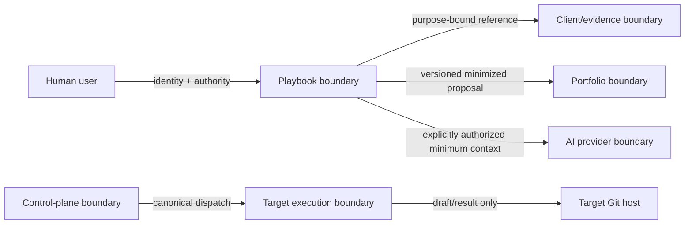

# Security Architecture

## Security objectives

Protect client confidentiality, preserve reasoning/decision integrity, prevent unauthorized state changes or publication, maintain attributable audit history, and keep consulting usable without unsafe external transfer. Compliance is not claimed merely because controls or templates exist.

## Trust boundaries

Every crossing validates identity where relevant, contract/version, classification, purpose, destination, minimum content, integrity and current authority. External owners are not implicitly trusted to authorize this repository's action, nor vice versa.

## Authentication and authorization concepts

- Authentication establishes human/service identity using an external identity capability; mechanism is deployment-specific.
- Authorization combines role, engagement/subject scope, action, classification, purpose, destination, conditions and freshness.
- Stakeholder participation never implies decision rights. AI identities cannot hold human decision authority.
- Service credentials are narrowly scoped per adapter/environment; target executor tokens cannot merge or administer unrelated repositories.
- Privileged decisions require fresh resolution. Cached authorization cannot survive revocation or grant cross-boundary action.
- Break-glass, if introduced, requires separate approval, time limit, alerting and retrospective review.

## Information classification and privacy

Unknown information is restricted. The eventual taxonomy and handling rules require owner approval. Collect minimum necessary information; prefer locators and provenance over copies. Enforce purpose limitation, permitted use, destination and expiry. Separate tenant/engagement data in storage, access checks, caches, search, exports, logs and backups. Support authorized retention, legal hold, deletion and subject rights only after applicable rules are confirmed.

## Secrets management

Secrets never reside in source, content artifacts, prompts, generated reports, command payloads or logs. Runtime secrets come from an approved secret manager, are short-lived where possible, scoped, rotated, auditable and unavailable to untrusted execution. Redaction is defense-in-depth, not permission to log. Repository validation scans changed content for credential patterns.

## Integrity and auditability

Use immutable versions, content digests for exchange, optimistic concurrency and atomic state/audit commits. Audit actor/service, action, subject, prior/new state or revisions, authority/policy decision reference, rationale, time, correlation and outcome—without unnecessary client content. Audit access and exports are themselves audited. Clock and identity sources must be trustworthy enough for the risk tier.

## Threat considerations

| Threat | Architectural controls |
|---|---|
| Prompt injection / malicious evidence | Treat all external content as data; bounded prompts, no tool authority, allowlisted actions, human review. |
| Data exfiltration | Classification gates, minimization, destination-specific transfer, egress control, no prompt/log secrets. |
| Fabricated facts or provenance | Typed epistemic records, source locators, sufficiency review, AI labels, immutable history. |
| Unauthorized approval | Fresh scoped authority, structured state transition, separation of duties; no narrative inference. |
| Cross-engagement leakage | Context-scoped authorization, partitioned stores/search/caches, negative isolation tests. |
| Tampering/version rollback | Reviewed immutable releases, digests/signing where risk warrants, protected branches and compatibility validation. |
| Duplicate/replaced publication | Stable effect identity, exact ownership marker, branch/PR inspection, fail-closed ambiguity. |
| Supply-chain compromise | Pinned/reviewed dependencies/actions, provenance, minimal permissions, isolated builds and upgrade rollback. |
| Denial of service/provider failure | Quotas, size limits, circuit breakers and complete offline/manual workflow. |
| Over-retention | Retention metadata and disposition workflow; avoid collecting raw evidence. |

## AI security

Before AI use: classify data, verify purpose/destination authorization, minimize context and record provider/model policy. Disable provider training/retention where required by approved policy. AI output is untrusted, scanned/validated and attributed. It cannot change authority, classification, decisions, external tasks or production. High-impact findings and specialist domains require defined human review thresholds.

## Target executor security

Validate the immutable release's documented public schema/API, stable portfolio
repository-change approval proof, exact target, and local executor/mode,
classification and publication policy. Routing admission is not target authority;
a mutable approval/queue label is not proof. Bind proof to authority, approved
revision/scope, target and time and fail closed for material edits, stale evidence,
withdrawal, revocation or mismatch. Run bounded tooling with minimal credentials
and no uncontrolled network/secrets. Validate paths, secrets and tests. Permit only
deterministic draft publication; never direct `main`, auto-merge or automatic
merge. Sanitize canonical result messages and preserve ambiguity for reconciliation.

## Security verification

Threat modeling, access-control matrices, contract fuzzing, malformed/oversized input tests, cross-tenant denial, secret scanning, dependency/provenance scanning, AI prompt-injection evaluation, audit completeness, backup/restore authorization and incident exercises are release gates proportionate to risk. Unresolved classification, retention and jurisdiction questions block operational handling of affected information.
