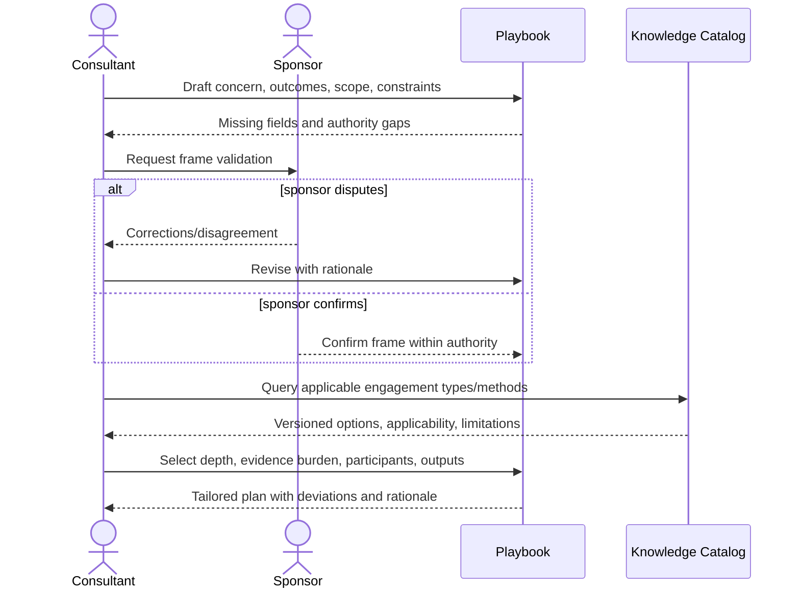
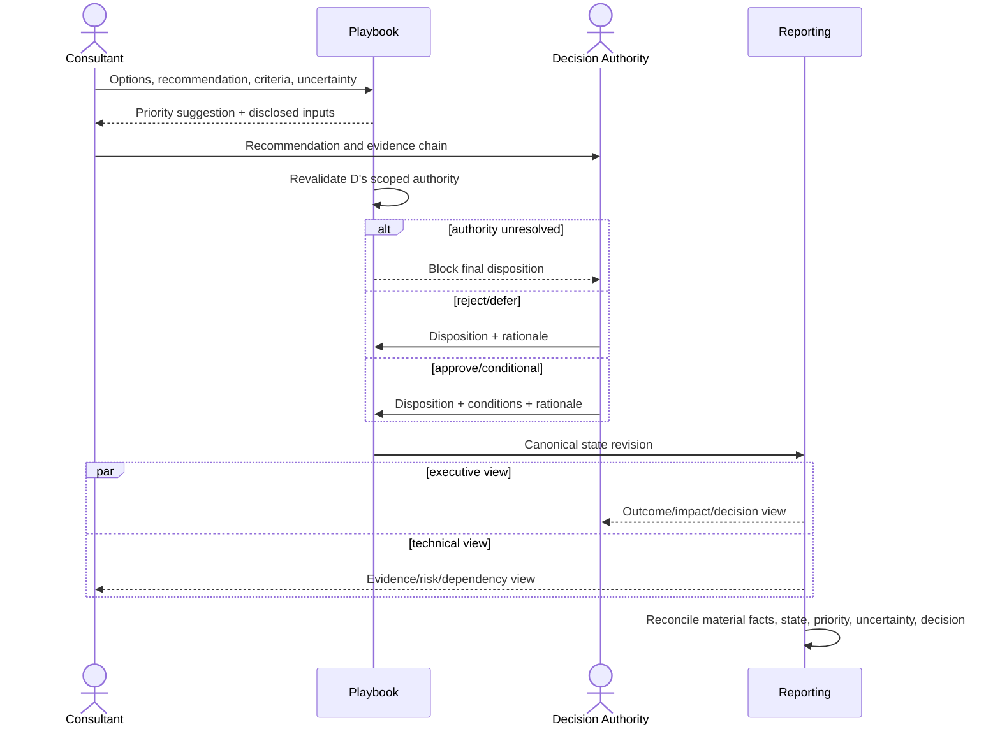
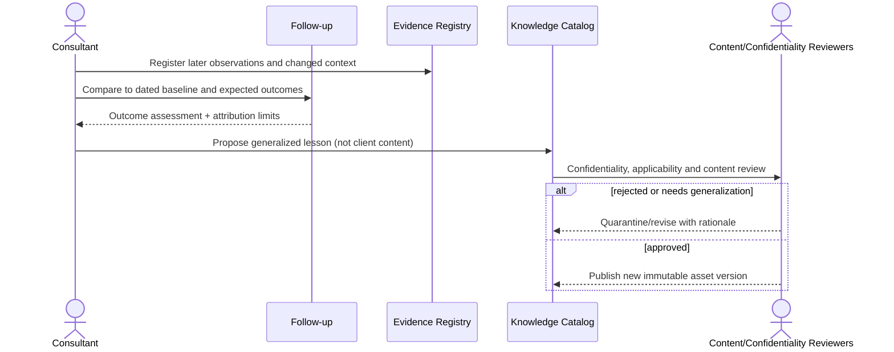
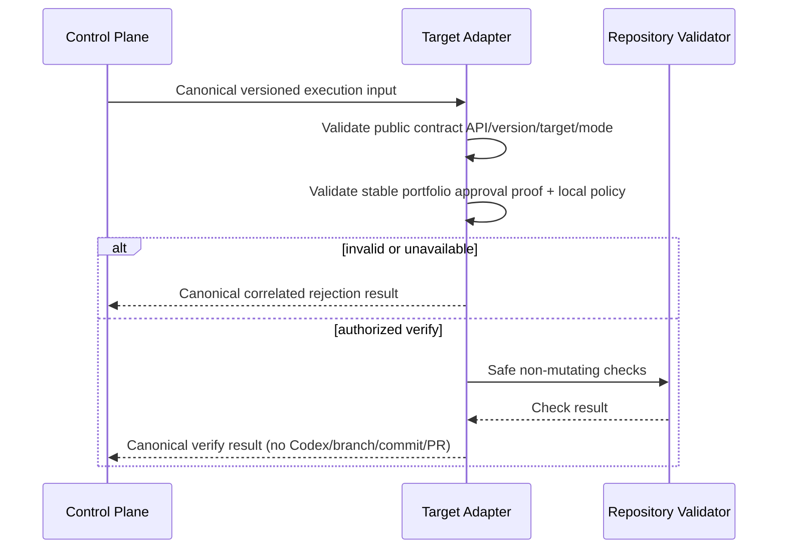

# Sequence Diagrams

## 1. Frame and tailor an engagement



## 2. Evidence to validated finding, including insufficiency

```mermaid
sequenceDiagram
  actor C as Consultant
  participant G as Information Governance
  participant E as Evidence Registry
  participant A as Assessment
  actor R as Reviewer/Authority
  C->>G: Proposed request + purpose + destination
  alt unknown/prohibited classification
    G-->>C: Deny/restrict; minimize or resolve
  else authorized
    G-->>C: Purpose-bound authorization
    C->>E: Register reference, provenance, kind, limitations
    E-->>C: Validated/access-limited entry
    C->>A: Assess sufficiency and contrary evidence
    alt insufficient
      A-->>C: Collect more / narrow / stop
    else sufficient
      C->>A: Propose finding and implication
      A->>R: Review reasoning chain
      alt disputed
        R-->>A: Disputed + rationale; retain prior state
      else accepted
        R-->>A: Validate
      end
    end
  end
```

## 3. Recommendation, decision and reports



## 4. Portfolio handoff and lost acknowledgement

```mermaid
sequenceDiagram
  participant P as Playbook
  participant G as Governance
  participant A as Portfolio Adapter
  participant T as Portfolio Tasks
  P->>P: Select approved/conditional decision; propagate conditions
  P->>G: Validate minimum transfer + destination authorization
  G-->>P: Permit
  P->>A: Submit versioned proposal + idempotency key
  A->>T: Owner-defined intake contract
  alt acknowledgement received
    T-->>A: Accepted external ID/revision
    A-->>P: Acknowledged
  else business rejection
    T-->>A: Rejected + safe reason
    A-->>P: Rejected; human correction required
  else response lost
    Note over P,T: outcome is indeterminate; do not create a new identity
    P->>A: Reconcile same identity
    A->>T: Query/deduplicate by identity
    T-->>A: Existing result or confirmed absence
    A-->>P: Reconciled outcome
  end
```

## 5. Follow-up and lesson governance



## 6. Verify-mode target execution



## 7. Implement-mode publication, race and ambiguity

```mermaid
sequenceDiagram
  participant C as Control Plane
  participant T as Target Adapter
  participant H as Git Host
  participant X as Bounded Executor
  T->>T: Validate stable approval proof + target policy
  T->>H: Inspect deterministic branch + all PRs for delivery identity
  alt one valid open managed draft
    H-->>T: Existing draft
    T-->>C: Reused success/result
  else branch/marker/closed-PR ambiguity
    H-->>T: Conflicting state
    T-->>C: Blocked; manual recovery required
  else new delivery
    T->>X: Authorized bounded task
    X-->>T: Candidate changes
    T->>T: Validate and test; commit locally
    T->>T: Revalidate approval freshness/revocation + target policy
    alt approval revoked, stale, or unavailable
      T-->>C: Rejected; no remote publication effects
    else publication still authorized
      T->>H: Create deterministic remote branch
      alt another attempt wins
        H-->>T: Create conflict
        T->>H: Immediate requery
      end
      T->>H: Create/requery managed draft with exact marker
      H-->>T: Exactly one valid draft or ambiguity
      T-->>C: Deliver/expose canonical success or ambiguous result
    end
  end
```

If the executor returns no changes, the adapter emits the canonical no-change
outcome without branch or PR creation. If result delivery acknowledgement is lost,
the same result identity is reconciled/replayed without a second lifecycle
transition. The organization-owned transport and lifecycle terms require external
confirmation; these diagrams intentionally do not create local equivalents.
