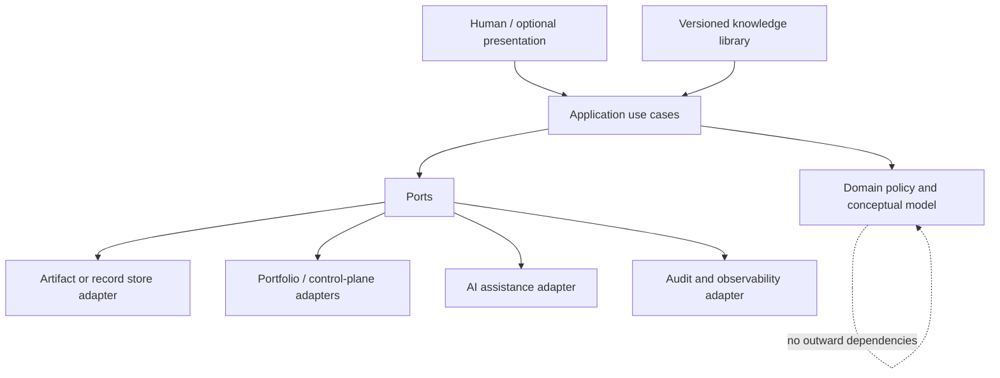

# Software Architecture Overview

## Status and authority

This is the authoritative architecture for `Young-Consultations/consulting-playbook`. It interprets the approved Vision and Requirements; the precedence is **Vision → Requirements → Architecture → implementation**. Existing automation is a transitional implementation reference, not the product architecture. Unknown external details remain validation obligations rather than implied designs.

## Executive summary

The repository is a versioned, portable **consulting knowledge and reasoning system** plus a bounded AI-SDLC target adapter. It enables practitioners to frame engagements, tailor methods, register evidence without copying protected source material, reason from findings to governed decisions, produce reconciled reports and hand approved recommendations to an external portfolio authority. Human judgment remains authoritative. The target adapter independently validates approved repository work and can publish only an idempotent draft change for review.

The target architecture is a modular monolith of content and domain services, surrounded by ports. This makes offline, human-readable use the baseline while allowing future user interfaces, stores, automation and external integrations without embedding them in consulting semantics.

## Architectural vision and goals

1. Preserve a reviewable chain from concern and evidence through action and outcome.
2. Make consulting methods reusable yet explicitly tailorable.
3. Keep facts, assertions, observations, inferences, findings, implications, recommendations and decisions semantically distinct.
4. Protect authority, confidentiality and client boundaries by default.
5. Offer executive and technical views derived from one material truth.
6. Keep reusable knowledge separate from engagement-instance information.
7. Support deterministic, testable, fail-closed external handoffs.
8. Make every artifact comprehensible to humans and AI agents through stable identifiers, contracts and provenance.

## Design principles

| Principle | Architectural consequence |
|---|---|
| Evidence before recommendation | Validation gates prevent a material finding from becoming final without sufficient evidence or an accepted limitation. |
| Human authority | AI and calculations propose; named authorities decide. No narrative text grants authority. |
| Clean boundaries | Domain policy has no dependency on UI, storage, GitHub or AI providers. |
| Portable core | Canonical artifacts are open, versioned and human-readable; a hosted runtime is optional. |
| Minimize sensitive data | References and classifications are preferred to copied evidence. Unknown classification is restricted. |
| Explicit uncertainty | Gaps, contrary evidence, confidence and limitations are first-class. |
| Cohesive modules | Modules align to engagement, evidence, analysis, action, knowledge and delivery capabilities. |
| Fail closed | Ambiguous ownership, state, classification or authorization stops controlled transitions. |
| Evolution by contracts | Schemas, content and ports are independently versioned with compatibility statements and migrations. |

## Guiding constraints

- This repository does not own portfolio approval, organization routing, Slugger, client source systems, merge or production authorization.
- Other repositories were not inspected; only required contracts are described.
- Applicable law, client obligations and explicit human safety authority precede tailoring.
- Offline use and implementation neutrality remain requirements until explicitly superseded.
- Engagement records need not reside in this repository. If a future runtime stores them, tenancy, retention and privacy require a separate approved design.
- Verify execution is non-mutating; implement execution is draft-only and never merges or pushes to `main`.

## Quality attributes

| Attribute | Required architectural response |
|---|---|
| Integrity | Immutable history, provenance, state guards, referential validation and reconciled projections. |
| Security/privacy | Classification gates, least privilege, minimization, destination-specific transfer authorization and secret isolation. |
| Maintainability | Dependency rule, stable IDs, modular content, ADRs, automated lint/link/contract tests. |
| Reliability | Atomic transitions, idempotent handoff/publication, explicit recovery and evidence preservation. |
| Usability/accessibility | Plain-language guidance, progressive disclosure, keyboard/screen-reader compatible presentations and portable formats. |
| Scalability | Independently scale stateless orchestration and projections; partition engagement records if a runtime emerges. |
| Observability | Correlation IDs, audit events, health signals and sanitized diagnostics without client content. |
| Testability | Pure policy rules, port contract tests, scenario fixtures and traceable acceptance tests. |
| AI safety | Bounded context, disclosed assistance, provenance and mandatory professional review. |

## Architectural style

The primary style is **clean/hexagonal architecture within a modular monolith**. The knowledge distribution can operate as documentation alone; an optional application runtime implements the same application ports. Domain events record meaningful transitions but do not imply a particular broker. CQRS-like projections may create audience views, while the governed reasoning model remains canonical. External integrations use anti-corruption adapters.

## System and repository responsibilities

Owned capabilities are: engagement framing and tailoring; stakeholder/authority mapping; evidence planning, registration and sufficiency; current-state and domain assessment; findings, causal hypotheses and options; recommendations, decisions, roadmaps, reporting and follow-up; reusable knowledge governance; information handling policy; recommendation-to-action contract creation; and repository-local target execution policy.

Not owned are authoritative client evidence, portfolio state, external routing/contracts, external product generation, client decisions, source changes in other targets, merge/release/production decisions, and compliance certification.

## Major components

| Component | Responsibility |
|---|---|
| Knowledge Catalog | Versioned methods, domains, templates, patterns, applicability and compatibility. |
| Engagement Context | Frame, scope, tailoring, stakeholders and authority. |
| Evidence & Assessment | Requests, references, provenance, sufficiency, baseline and capability evaluation. |
| Reasoning Chain | Findings, implications, causes, options, recommendations and trace links. |
| Decision & Action | Governed decisions, prioritization, roadmaps, handoff and follow-up. |
| Reporting | Materially consistent executive/technical projections. |
| Information Governance | Classification, permitted use, minimization, transfer and AI-use gates. |
| Integration Gateway | Ports and anti-corruption adapters for external collaborators. |
| Target Execution Adapter | Verify/implement authorization and exactly-once publication-effect policy. |
| Audit/Observability | Append-only decision/state history, correlation and safe operational signals. |

## Architectural decisions

The baseline decisions are detailed in `ADR.md`: portable canonical artifacts; clean modular core; separate knowledge definitions from engagement instances; explicit reasoning graph; stateful governed records; ports for all external systems; projections rather than duplicated reports; fail-closed security; idempotent external effects; and optional runtime rather than runtime-first design.

## Risks and technical debt assessment

| Risk/debt | Current assessment | Treatment |
|---|---|---|
| Intended knowledge assets absent | Critical product gap | Prioritize coherent pilot content, not platform breadth. |
| Engagement storage and privacy unknown | Architecture blocker for hosted records | Keep core portable; require data protection design before persistence. |
| External contracts not verified | High integration risk | Contract-test against owner-provided fixtures; never infer behavior. |
| Rating vocabulary/sign-off unknown | Analysis integrity risk | Keep rating schemes pluggable and contextual. |
| Current executor dominates repository | Transitional coupling risk | Isolate it as a delivery adapter; do not make it the product core. |
| Markdown can drift semantically | Maintainability risk | Stable IDs, metadata validation, link checks and governed releases. |
| Accessibility/export needs unknown | Product adoption risk | Validate representative outputs during pilots. |

## Future evolution strategy

1. **Foundation:** publish glossary, principles, canonical metadata, lifecycle rules and two or three validated engagement paths.
2. **Pilot:** exercise complete reasoning chains with synthetic/de-identified scenarios; validate audience views and handoff contracts.
3. **Automation:** add validators, generators and optional local tooling behind ports.
4. **Runtime only if justified:** add collaboration/persistence after tenancy, retention, accessibility and privacy decisions.
5. **Integration:** certify adapters with external contract owners and compatibility suites.
6. **Continuous governance:** measure method usefulness, record generalized lessons through review, deprecate safely and preserve historical reproducibility.

Architecture changes must cite affected Vision/requirement IDs, record compatibility and security consequences, update traceability, and receive the required human review.
