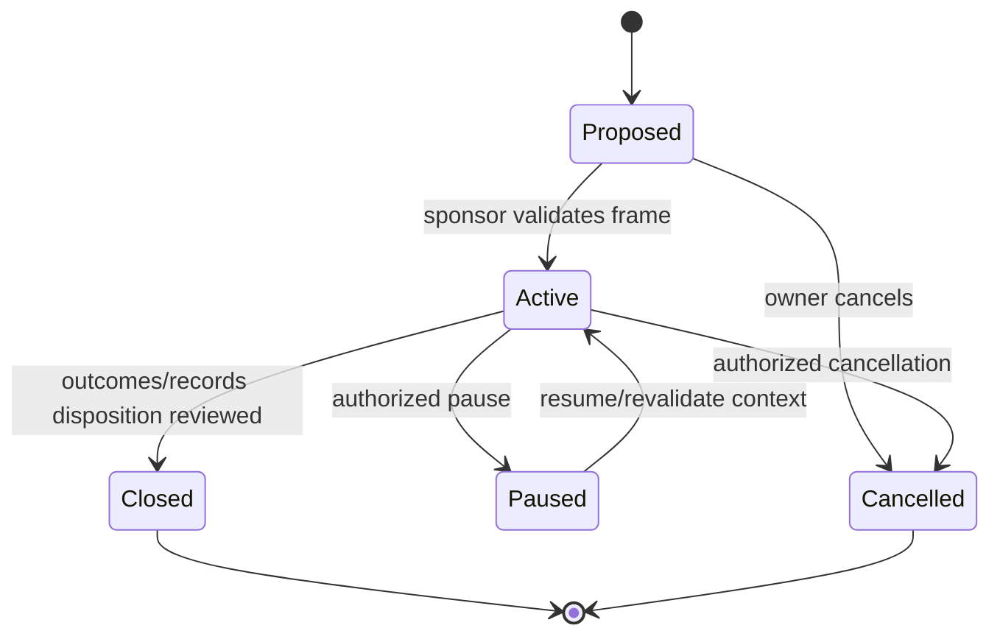
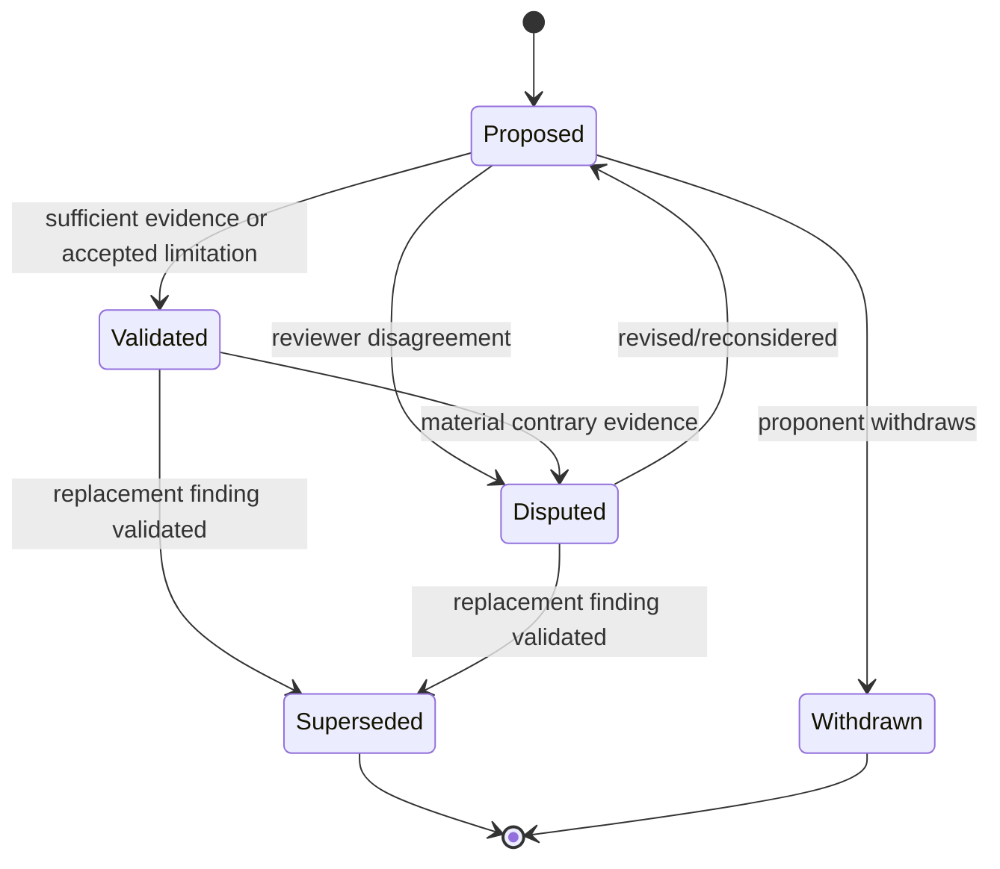
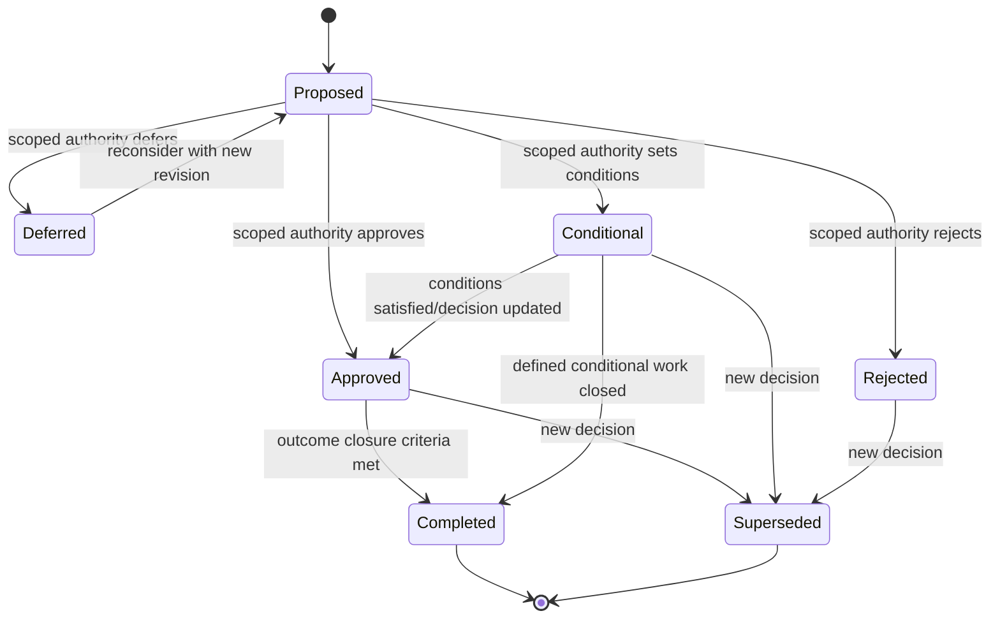
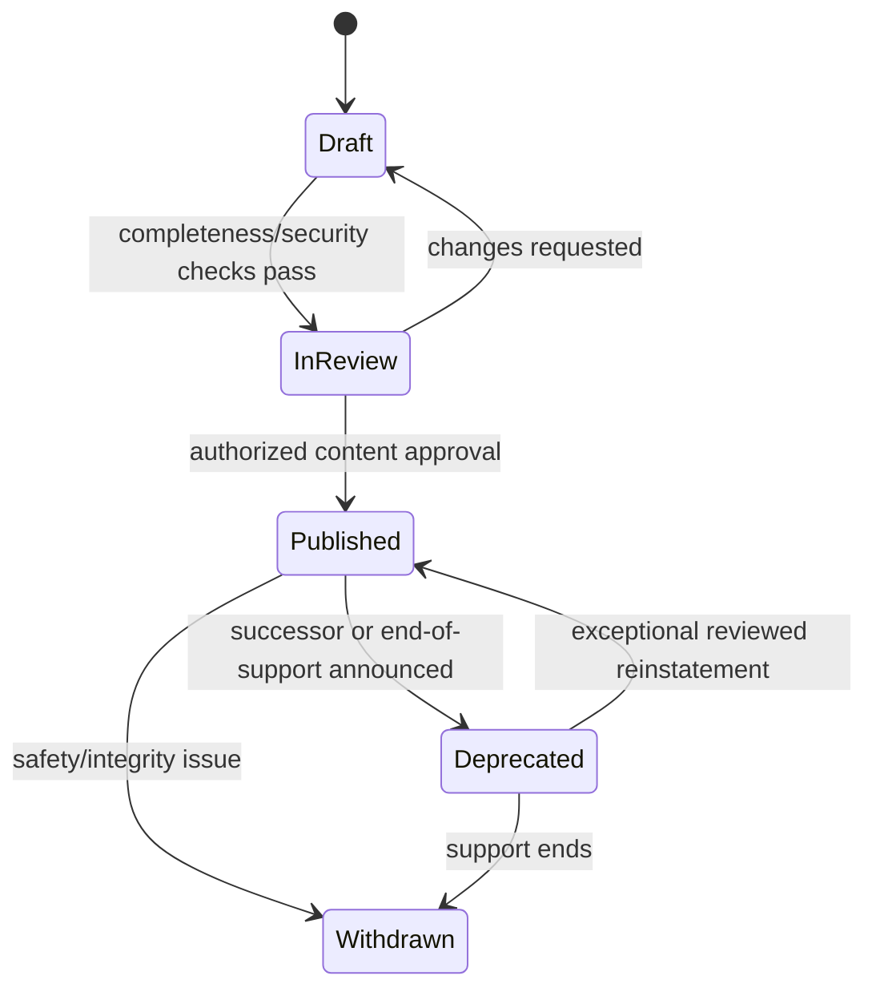
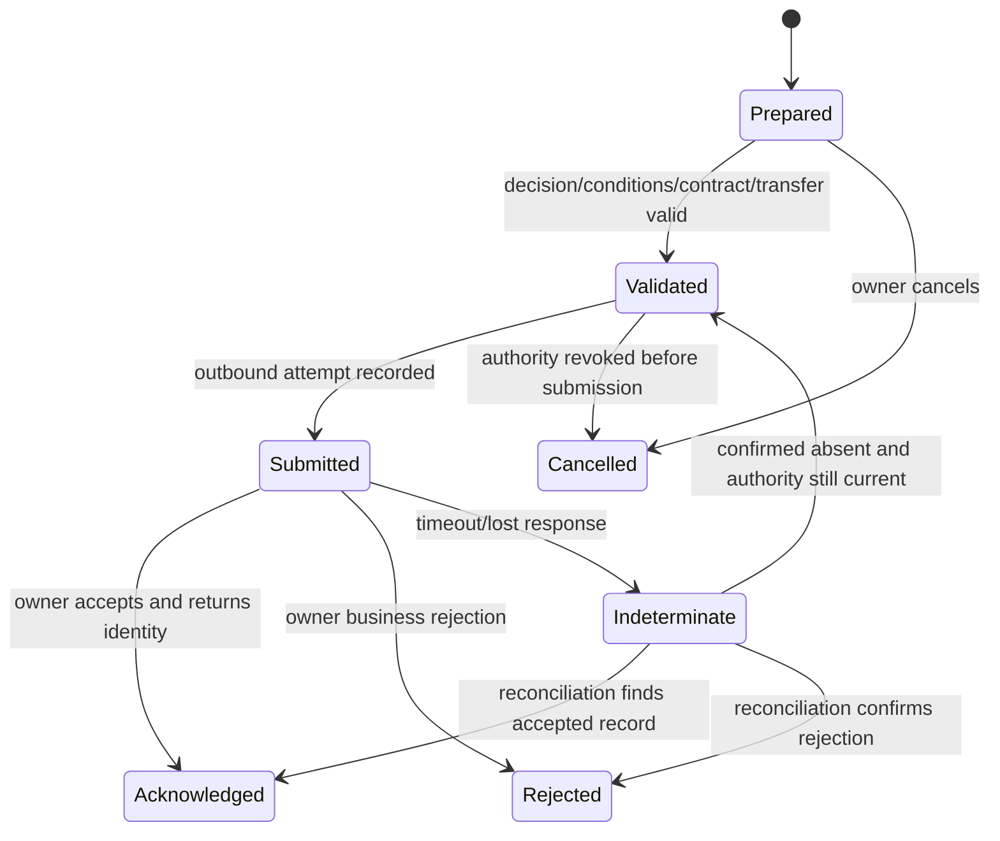
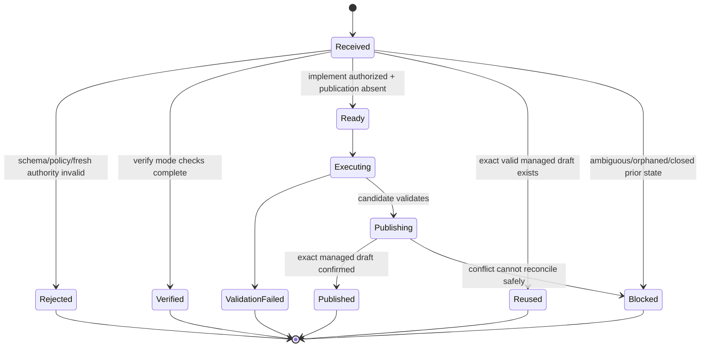

# State Models

## State-model rules

Transitions require actor, time, rationale, prior state, expected revision and applicable authority. Invalid transitions fail without partial mutation. Supersession preserves history. “Unknown,” “disputed,” “not applicable” and blank are not lifecycle shortcuts.

## Engagement

Entry to Active requires owner/sponsor, scope, purpose and visible gaps. Closure requires final status, unresolved items and retention/handoff disposition; it does not imply recommendations completed.

## Finding

Validated is prohibited when material support is insufficient and no proper limitation acceptance exists. Dispute preserves both positions and evidence.

## Recommendation and decision

Recommendation content revisions and authority decisions are separate records. Entry to roadmap is allowed only from Approved or Conditional, with all conditions attached. Completion is not proof of benefit; follow-up evaluates outcome.

## Knowledge asset

Published versions are immutable; updates produce a new version. Client-derived lessons require confidentiality/generalization review before InReview.

## Handoff

Retry from Indeterminate is reconciliation-first and uses the same idempotency identity. Revoked authority cannot be restored by retry.

## Target delivery/publication

Blocked recovery is manual evidence-preserving reconciliation. A replacement requires a newly authorized logical delivery identity; the same identity cannot overwrite or reopen history.

## Evidence reference

Requested → Available → Validated or Disputed; Available/Validated may become Inaccessible or Retired. Inaccessible records retain provenance and limitation. Retired means no longer usable under policy, not that history is erased contrary to retention obligations.
